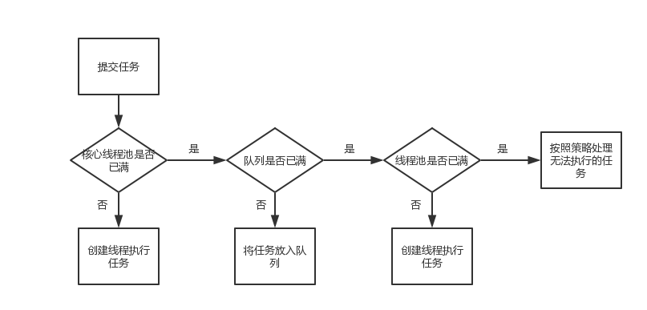
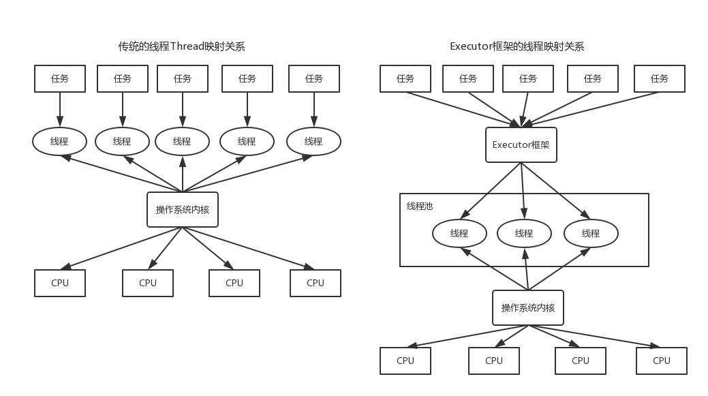
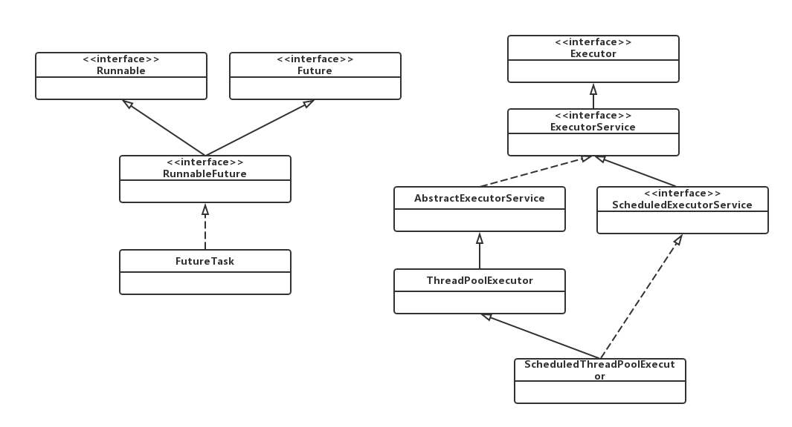

# Java线程池

## 1. 简介

系统启动一个新线程的成本是比较高的，因为它涉及与操作系统的交互，这个时候使用线程池可以提升性能，尤其是需要创建大量声明周期很短暂的线程时。Java中的线程池是运用场景最多的并发框架。

线程池类似于数据库连接池，在系统启动的时候即创建大量空闲的线程，可以将一个线程任务提交给线程池执行，当任务执行完后，线程不会死亡，而是再次返回线程池中成为空闲状态。

#### 使用线程池的好处

- 降低资源消耗：重复利用降低创建和销毁线程的消耗；
- 提高响应速度：任务来了可以理解执行，不必等待线程创建；
- 提高线程的可管理性：使用线程池可以统一的分配、调优和监控。

## 2. 使用Executors工厂类来产生线程

Executors工厂类主要有4种方式生产线程池：

**1.newCachedThreadPool() ：**创建一个具有缓存功能的线程池，线程池无边界，适用于执行很多短期异步任务的小程序，或者负载较轻的服务器。

**2. newFixedThreadPool(int nThreads)：**创建一个固定线程数的线程池，适用于为了满足资源管理的要求而需要限制线程数量的场景，比如负载较重的服务器。

**3. newSingleThreadExecutor()：**创建一个只有单线程的线程池，适用于需要保证顺序地执行各个任务，并且在任意时间点不会有多个线程是活动的西场景。

**4. newScheduledThreadPool(int corePoolSize)：**创建一个具有指定线程数的线程池，并可以在指定延迟后执行线程任务，适用于多个后台线程执行周期任务，同时为了满足资源管理需要限制线程数量的场景。

### 实例代码

```java
package com.wangjun.thread;

import java.util.concurrent.Callable;
import java.util.concurrent.ExecutionException;
import java.util.concurrent.ExecutorService;
import java.util.concurrent.Executors;
import java.util.concurrent.Future;
import java.util.concurrent.ScheduledExecutorService;
import java.util.concurrent.TimeUnit;

/*
 * 演示线程池的使用
 */
public class ThreadPoolTest {

	public static void main(String[] args) throws InterruptedException, ExecutionException {
		
		//生产普通的线程池
		ExecutorService threadPool = Executors.newFixedThreadPool(6);
		// 第一种执行线程的方式
		threadPool.submit(new MyThread()); 
		// 第二种执行线程的方式，有返回值
		Future<String> result = threadPool.submit(new MyThread(), "返回值1"); 
		System.out.println(result.get());
		// 第三种执行线程的方式，传入Callable对象，有返回值
		Future<String> result2 = threadPool.submit(new MyThread2()); 
		System.out.println(result2.get());
		
		// 关闭线程池,不再接受新的任务，会将之前所有提交的任务执行完成，所有任务完成后，所有的线程死亡
		// 调用shutdownNow可以立马停止所有线程
		threadPool.shutdown();
		System.out.println("-----");
		// 生产可以延迟执行的线程池
		ScheduledExecutorService threadPool2 = Executors.newScheduledThreadPool(6);
		// 延迟1秒执行
		threadPool2.schedule(new MyThread(), 1, TimeUnit.SECONDS);
		// 延迟2秒后执行，每一秒循环执行一次
		// 是以上一个任务开始的时间计时，period时间过去后，检测上一个任务是否执行完毕，如果上一个任务执行完毕，
		// 则当前任务立即执行，如果上一个任务没有执行完毕，则需要等上一个任务执行完毕后立即执行。
		threadPool2.scheduleAtFixedRate(new MyThread(), 2, 1, TimeUnit.SECONDS);
		// 是以上一个任务结束时开始计时，period时间过去后，立即执行。
		// 两个方法以不同的时间点作为参考
		threadPool2.scheduleWithFixedDelay(new MyThread(), 2, 1, TimeUnit.SECONDS);
		
		Thread.sleep(3000);
		threadPool2.shutdown();
	}

	static class MyThread extends Thread {
		@Override
		public void run() {
			System.out.println("线程：" + Thread.currentThread().getName());
		}
	}
	
	static class MyThread2 implements Callable<String>{
		@Override
		public String call() throws Exception {
			System.out.println("线程：" + Thread.currentThread().getName());
			return "返回值2";
		}
	}

}
```

## 3. 线程池类ThreadPoolExector

上面使用Executors工厂类生产线程池，其实大部分返回的就是ThreadPoolExector的实例。ThreadPoolExector才是真正的线程池。

### 3.1 线程池的几个关键属性

1. **核心线程数量corePoolSize：**核心线程数，指保留的线程池大小（不超过maximumPoolSize值时，线程池中最多有corePoolSize 个线程工作）。 
2. **最大线程数量maximumPoolSize：**指的是线程池的最大大小，使用使用了无界队列，那这个参数就没什么用。
3. **线程结束的超时时间keepAliveTime：**当一个线程不工作时，过keepAliveTime时间将停止该线程（该线程是多余的，指大于corePoolSize的那些线程）。
4. **存放任务的队列workQueue：**存放需要被线程池执行的线程队列。
5. **饱和策略handler：**加任务失败后如何处理该任务。通常是AbortPolicy，表示无法处理新任务时抛出异常。

### 3.2 线程池执行策略

线程池执行execute()方法的过程如图：



1. 线程池刚创建时，里面没有一个线程。任务队列是作为参数传进来的。不过，就算队列里面有任务，线程池也不会马上执行它们。
2. 当调用 execute() 方法添加一个任务时，线程池会做如下判断：

​    a. 如果正在运行的线程数量小于 corePoolSize，则创建线程执行任务（注意，这一步需要获取全局锁）；

​    b. 如果正在运行的线程数量大于或等于 corePoolSize并且队列没有满，那么将这个任务放入队列。

​    c. 如果这时候队列满了，而且正在运行的线程数量小于 maximumPoolSize，那么还是要创建线程运行这个任务；

​    d. 如果队列满了，而且正在运行的线程数量大于或等于 maximumPoolSize，那么线程池会交给配置的执行策略处理（调用`RejectedExecutionHandler.rejectedExecution`方法），比如抛出异常，提示无法加入新线程。

3. 当一个线程完成任务时，它会从队列中取下一个任务来执行。
4. 当一个线程无事可做，超过一定的时间（keepAliveTime）时，线程池会判断，如果当前运行 的线程数大于 corePoolSize，那么这个线程就被停掉。所以线程池的所有任务完成后，它最终会收缩到 corePoolSize 的大小。


### 3.3 线程池中阻塞队列的种类

1. ArrayBlockingQueue：居于数组结构的有界阻塞队列，按照先进先出FIFO原则对元素进行排序；
2. LinkedBlockingQueue：基于链表结构的阻塞队列，按照FIFO排序原色，吞吐量大于ArrayBlockingQueue，静态工厂方法Executors.newFixedThreadPool()就使用了这个队列；
3. SynchronousQueue：不存储元素的阻塞队列。每个插入操作必须等到另一个线程调用移除操作，否则插入操作一直处于阻塞状态，吞吐量通常要高于LinkedBlockingQueue，静态工程方法Executors.newCachedThreadPool()就使用了这个队列；
4. PriorityBlockingQueue：具有优先级的无限阻塞队列；
5. DelayedWorkQueue：ScheduledThreadPoolExecutor的内部类，类似于DelayedQueue，一个支持延时获取元素的无界阻塞队列。不同的是 DelayedWorkQueue并没有采用 PriorityQueue，而是自己实现的二叉堆算法。

### 3.4 饱和策略

一般情况下，线程池采用的是AbortPolicy，表示无法处理新任务时抛出异常。JDK1.5中java线程池框架提供了4种饱和策略：

- AbortPolicy：直接抛出异常；
- CallerRunsPolicy：使用调用者所在线程来运行任务；
- DiscardOldestPolicy：丢弃队列里最近的一个任务，并执行当前任务；
- DiscardPolicy：不处理，丢弃掉。

也可以根据场景来实现RejectedExecutionHandler接口来自定义策略。

### 3.5 向线程池提交任务

- execute：用于提交不需要返回值的任务，因此无法判断任务是否被线程执行成功；
- submit：用于提交需要有返回值的任务，返回一个Future对象，通过get()获取返回值，会阻塞当前线程直到任务完成。

### 3.6 关闭线程池

通过调用线程池的`shutdown`和`shutdownNow`方法来关闭线程池，他们的原理是遍历线程池中的工作线程，然后逐个调用线程的interrupt方法来中断线程，所以无法影响中断的任务可能永远无法终止。

这两个方法的区别是shutdownNow首先将线程池的状态设置为STOP，然后尝试停止所有的正在执行或暂停任务的线程，并返回等待任务的列表，而shutdown只是将线程池的状态设置为SHUTDOWN状态，然后中断所有没有正在执行任务的线程。

只要调用了这两个关闭方法中的任意一个，isShutdown方法就会返回true，当所有的任务都已关闭后，才表示线程池关闭成功，这时调用isTerminaed方法会返回true。通常调用shutdown来关闭线程池，如果任务不一定要执行完，则可以调用shutdownNow方法。

## 4. Executor框架

JDK5之前，java的线程Thread既是工作单元，也是执行单元（start方法执行），JDK5开始，把工作单元与执行机制分离开来，工作单元包括Runnable和Callable，而执行机制由Executor框架提供。（注意这里的Executor和Executors线程池工厂类不是一回事。）

线程池类ThreadPoolExecutor的继承关系：

```
ThreadPoolExecutor -> AbstractExecutorService -> ExecutorService(接口) -> Executor(接口)。
```

可以看到ThreadPoolExecutor就是Executor接口的一个实现方法。

### 4.1 Executor的两层调度模型

传统的java线程（java.lang.Thread）在JVM中被一对一映射为本地操作系统线程，java线程启动时会创建一个本地操作系统线程，当java线程终止时，这个操作系统线程也会被回收。

而在Executor框架中，将用户任务映射为固定数量的线程，在底层操作系统内核将这些线程映射到硬件处理器上，应用程序通过Executor框架控制上层调度，下层的调度由操作系统内核控制。



### 4.2 Executor框架的结构

Executor框架主要有3部分组成：

1. 任务：包括被执行任务需要实现的接口：Runnable和Callable；
2. 任务的执行：核心接口是Executor，继承Executor的ExecutorService接口。ExecutorService接口有两个核心实现类，ThreadPoolExecutor和ScheduledThreadPoolExecutor（继承ThreadPoolExecutor，可以延迟执行任务，比Timer更强大）。
3. 异步计算的结果：包括接口Future和实现Future接口的FutureTask类。

**来看一下Executor框架中主要类和接口的UML图：**




