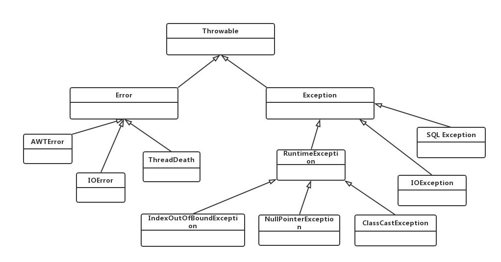

# Java异常

java异常分为两大类，Checked异常和Runtime异常，Checked异常都是在编译阶段可以被处理的异常。

### Checked异常和Runtime异常的区别和联系

* Checked异常都是可以被处理的异常，在程序中必须显式地处理Checked异常，如果没有处理，那么编译就会报错。而Runtime异常可以不被显式的处理；
* 都是Exception的子类，继承了RuntimeException的就是Runtime异常，其他的就是Checked异常。

### 常见异常类之间的继承关系：



**列举几个常见的运行时异常RuntimeException：**

* IndexOutOfBoundException：数组越界异常；
* NullPointerException：空指针异常；
* ClassCastException：类转换异常；
* NumberFormatException：数字格式异常；
* ArithmeticException：运算异常。

**列举几个非运行时异常（Checked异常）：**

* SQLException：SQL异常；
* IOException：IO异常；
* FileNotFoundException：文件找不到异常，是IOException的子类；
* InterruptedException：中断异常，一般用在多线程编程；
* ClassNotFoundException：类找不到。

**Error错误**

Error错误一般指与虚拟机相关的问题，如系统崩溃，虚拟机错误，动态链接失败等，这种错误无法恢复或不可被捕获，将导致应用程序中断。通常应用程序也无法处理这些错误，因此程序中不应该试图使用catch来捕获Error对象。在方法定义时，也无需throws Error对象。

### Checked异常的使用

前面提到了Checked必须显式的处理，不然编译报错，比如声明一个文件输入流：

```java
FileInputStream fis = new FileInputStream("test.md");
```

这段代码编译会报错

```
Unhandled exception type FileNotFoundException
```

因此必须显式的处理它，处理Checked异常的方式一般有两种：

* 如果知道如何处理，那么最好使用try…catch...块处理：

  ```java
  //Checked异常必须被显式处理
  try {
    FileInputStream fis = new FileInputStream("test.md");
  } catch (FileNotFoundException e) {
    e.printStackTrace();
    System.out.println("文件不存在！");
  }
  ```

* 如果不知道如何处理，那么就在方法中抛出，由上一级调用者处理：

  ```java
  public static void main(String[] args) throws FileNotFoundException {

    //Checked异常必须被显式处理
    //在main方法中抛出异常，交给JVM处理，JVM对异常的处理办法就是打印跟踪栈信息，并终止程序运行
    FileInputStream fis = new FileInputStream("test.md");
  }
  ```

### 使用throw自行抛出异常

有的时候根据业务需要，我们在程序里面会自行抛出异常，比如如果读取的文件内容为空，我们就认为这是一个异常，这时候我们可以使用throw来主动抛出异常，并且用catch捕获它：

```java
//使用throw主动抛出异常
try {
  FileInputStream fis = new FileInputStream("test.md");
  if(fis.read() == 0) {
    throw new IOException("空文件");
  }
} catch (IOException e) {
  e.printStackTrace();
}
```

如果throw抛出的是一个runtime异常，那么程序可以用try…catch…捕获，也可以不用理会。

### 异常链处理

在真实的企业级应用中，我们往往不会讲底层的异常暴露给上层应用，比如不会把SQL异常暴露到用户界面上。一是对于用户而言，看到SQL异常对他们也没啥帮助，二是对于恶意用户而言，暴露底层异常不安全。

那么如何屏蔽底层异常呢？通常的做法是：程序先捕获原始异常，然后抛出一个新的业务异常，新的业务异常包含了对用户的提示信息，这种处理方式成为异常转译。下面演示一个创建用户的程序如何屏蔽底层异常：

```java
//演示异常链，创建用户
public void createSubscriber(int subId) throws BusinessException {
  try {
    //创建用户的逻辑......

  }catch(Exception e){
    //处理并保存原始异常...

    //抛出新的业务异常
    throw new BusinessException("用户创建失败");
  }
}
```

可以看到程序把原始异常隐藏起来，仅向上提供必要的异常提示信息，可以保证底层异常不会扩展到表现层，这完全符合对象的封装原则。

这种把捕获一个异常然后抛出另一个异常，并把原始异常信息保存下来，是一种典型的链式处理，在设计模式中被称为**责任链模式**。

### 使用异常的几个建议

我们使用异常是为了实现几个目标：

* 使程序代码混乱最小化；
* 捕获并保留诊断信息；
* 通知合适的人员；
* 采用合适的方式结束异常活动。

针对这些目标，我们应该做到：

1. **不要过度使用和依赖它：**异常很方便，但是不要把正常的逻辑处理都使用异常处理，比如

```java
//原始代码
if(fileSize > 100){
  Sysotem.out.println("文件过大，请重新上传");
  continue;
}
//改成使用异常 
if(fileSize > 100){
  throw new Exception("文件过大，请重新上传");
}
//这样做，很明显不负责任。
```

1. **不要在try里面写很多代码：**这样可能增加异常分析的难度，并且大量的代码可能需要大量的catch来捕获不同的异常；
2. **避免使用catch来捕获所有类型的异常：**比如`catch(Throwable t)`或者`catch(Exception e)`这样，对所有异常使用同样的逻辑处理，不得不写很多if语句处理不同情况，得不偿失，并且这种捕获方式可能将Error、Runtime等可能导致程序终止的异常捕获，从而“压制”了异常，一些关键异常可能被悄悄忽略；
3. **不要忽略捕获到的异常：**catch应该做一些有用的事情，不要为空或者只打印异常，catch块为空就是瞒天过海，程序出了错误，所有人看不到任何异常，但是程序可能已经坏了！在捕获到异常的时候，要么处理它，要么抛出新异常，要么向上抛出并在合适的地方处理异常。

> 参考：
>
> 《疯狂java讲义》


