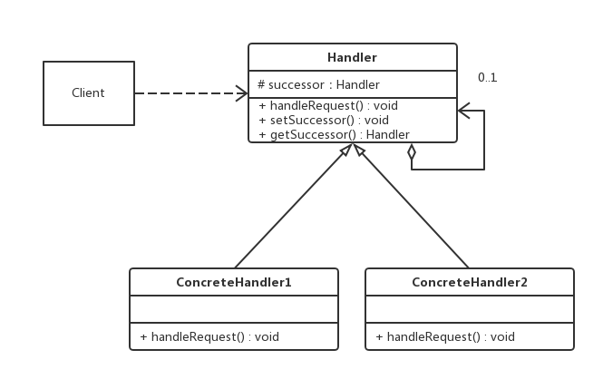

# Java设计模式之职责链模式

前几天复习java的异常处理时，接触到了责任链模式。在企业级应用中，从前台发过来的请求在后台抛出异常，异常处理的设计一般会用到责任链模式，比如sql异常并不会直接抛出给前台，而是经过一系列的处理和再封装，抛给前台一个用户可识别的异常信息。

## 1. 简介

职责链模式有时候也叫责任链模式，它是一种对象行为的设计模式。目的是：使多个对象都有机会处理请求，从而避免请求的发送者和接收者之间的耦合关系，将这些对象连成一条链，并沿着这条链传递该请求，直到有一个对象处理它为止。发送请求的客户端并不知道链上的哪个对象会处理这个请求，这使得系统在不影响客户端的情况下动态的组织和分配责任。

这里需要注意的是，职责链可以是一条直线、一个环链或者是一个树结构的一部分。

Tomcat中的Filter就是使用了责任链模式。还有java中类加载使用的**双亲委派模型**也是典型的责任链模式。

## 2. 参与者

职责链模式UML图：



一个典型的职责链对象图可能这样的：


- Handler：抽象处理者。定义一个处理请求的接口，如果需要，接口可以定义 出一个方法以设定和返回对下家的引用。这个角色通常由一个Java抽象类或者Java接口实现。上图中Handler类的聚合关系给出了具体子类对下家的引用，抽象方法handleRequest()规范了子类处理请求的操作。
- ConcreteHandler：具体处理者。具体处理者接受到请求后，可以选择立即处理这个请求或者将请求传递给下家。由于具体处理者持有对下家的引用，因此，如果需要，具体处理者可以访问下家。
- Client：客户端。向处理者提交请求对象。

## 3. 代码示例

**需求：**部门搞活动向公司申请经费，金额小于1000的项目经理就可以审批，小于2000的部门经理可以审批，大于2000的只能总经理审批。

这里就使用职责链模式。申请人提交给项目经理申请经费，项目经理如果权限够的话就审批，不够的话就提交到上级领导，依次类推，直到能够处理请求为止。

**代码实现：**

Handler：审批人员的抽象父类

```java
package com.wangjun.designPattern.chainOfResponsibility;

public abstract class Handler {
	protected Handler successor;
	
	public abstract boolean handler(int fee);
	
	public abstract void setSuccessor(Handler successor);
	
	public abstract Handler getSuccessot();
}
```

ConcreteHandler1：项目经理

```java
package com.wangjun.designPattern.chainOfResponsibility;

public class ProjectManager extends Handler {

	@Override
	public boolean handler(int fee) {
		if(fee <= 1000) {
			System.out.println("项目经理：审批通过。金额：" + fee);
			return true;
		}else {
			System.out.println("金额大于1000，项目经理无权审批，移交给部门经理！");
			setSuccessor(new DepartmentManager());
			return successor.handler(fee);
		}
	}

	@Override
	public void setSuccessor(Handler successor) {
		this.successor = successor;
	}

	@Override
	public Handler getSuccessot() {
		return successor;
	}

}
```


ConcreteHandler2：部门经理

```java
package com.wangjun.designPattern.chainOfResponsibility;

public class DepartmentManager extends Handler {

	@Override
	public boolean handler(int fee) {
		if(fee <= 2000) {
			System.out.println("部门经理：审批通过。金额：" + fee);
			return true;
		}else {
			System.out.println("金额大于2000，部门经理无权审批，移交给总经理！");
			setSuccessor(new Manager());
			return successor.handler(fee);
		}
	}

	@Override
	public void setSuccessor(Handler successor) {
		this.successor = successor;
	}

	@Override
	public Handler getSuccessot() {
		return successor;
	}

}
```


ConcreteHandler3：总经理

```java
package com.wangjun.designPattern.chainOfResponsibility;

public class Manager extends Handler {

	@Override
	public boolean handler(int fee) {
		if(fee <= 10000) {
			System.out.println("总经理：审批通过。金额：" + fee);
			return true;
		}else {
			System.out.println("金额大于10000，审批不通过！申请金额：" + fee);
			return false;
		}
	}

	@Override
	public void setSuccessor(Handler successor) {
		this.successor = successor;
	}

	@Override
	public Handler getSuccessot() {
		return successor;
	}

}
```

Client：客户端申请费用

```java
package com.wangjun.designPattern.chainOfResponsibility;

public class Client {

	public static void main(String[] args) {
		// 测试申请费用列表
		int[] arr = {500, 1500, 2500, 29000}; 
		
		// 将申请提交给的项目经理
		ProjectManager pm = new ProjectManager();
		
		for(int i = 0; i < arr.length; i++) {
			System.out.println("第" + (i+1) + "笔费用");
			if(pm.handler(arr[i])) {
				System.out.println("申请经费成功！");
			}else {
				System.out.print("申请经费失败！");
			}
			System.out.println();
		}
	}

}

```

运行结果：

```shell
第1笔费用
项目经理：审批通过。金额：500
申请经费成功！

第2笔费用
金额大于1000，项目经理无权审批，移交给部门经理！
部门经理：审批通过。金额：1500
申请经费成功！

第3笔费用
金额大于1000，项目经理无权审批，移交给部门经理！
金额大于2000，部门经理无权审批，移交给总经理！
总经理：审批通过。金额：2500
申请经费成功！

第4笔费用
金额大于1000，项目经理无权审批，移交给部门经理！
金额大于2000，部门经理无权审批，移交给总经理！
金额大于10000，审批不通过！申请金额：29000
申请经费失败！
```


## 4. 总结

可以在一下情况下使用职责链模式：

- 有多个对象可以处理同一个请求，哪个对象处理请求在运行时刻自动确定；
- 你想在不明确指定接受者的情况下，向多个对象的一个提交请求；
- 可处理一个请求的对象集合应被动态指定。

**纯的与不纯的责任链模式**

一个纯的责任链模式要求一个具体的处理者对象只能在两个行为中选择一个：一是承担责任，二是把责任推给下家。不允许出现某一个具体处理者对象在承担了一部分责任后又把责任向下传的情况。

在一个纯的责任链模式里面，一个请求必须被某一个处理者对象所接收；在一个不纯的责任链模式里面，一个请求可以最终不被任何接收端对象所接收。

纯的责任链模式的实际例子很难找到，一般看到的例子均是不纯的责任链模式的实现。有些人认为不纯的责任链根本不是责任链模式，这也许是有道理的。但是在实际的系统里，纯的责任链很难找到。如果坚持责任链不纯便不是责任链模式，那么责任链模式便不会有太大意义了。


loading...

后续研究一下tomcat的Filter机制。


> 参考：
>
> 《设计模式》
>
> https://blog.csdn.net/m13666368773/article/details/7702368