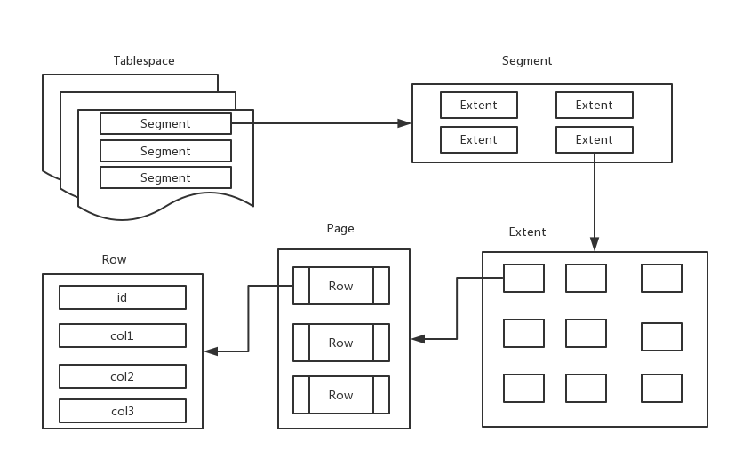

# InnoDB介绍

InnoDB是事务安全的mysql存储引擎，也是mysql的默认存储引擎，特点是行锁设计、支持MVCC、支持外键、提供一致性非锁定读。同时也被设计用来最有效地利用以及使用内存和CPU。

### InnoDB逻辑存储结构

从InnoDB存储引擎的逻辑存储结构来看，所有数据都被逻辑地存放在一个空间中，称之为表空间。表空间依次由段（segment）、区（extent）、页（page）组成。页有时候也叫块（block）。 

**1. 表空间**

所有的数据都存放在表空间中，包括数据、索引、插入缓冲Bitmap页、回滚（undo）信息、系统事务信息、二次写缓冲等。默认情况下InnoDB有一个共享表空间ibdata1，即所有数据默认存储在这个表空间内。如果用户启用了参数innodb_file_per_table，则每张表内的数据可以单独放到一个表空间中。启用了这个参数，每张表的表空间内存放的只是数据、索引和插入缓冲页，其他类型的数据还是存放在共享表空间内。

**2. 段**

常见的段有数据段、索引段、回滚段等。在B+树中，数据段就是叶子节点，索引段就是非索引节点。

**3. 区**

区是由连续页组成的空间，在任何情况下，每个区的大小都是1MB，默认情况下，一个区中有64个连续的页。

**4. 页**

页是InnoDB磁盘管理的最小单位，默认大小为16KB，常见的页类型有：

- 数据页（B-tree Node）
- undo页（undo Log Page）
- 系统页（System Page）
- 事务数据页（Transaction system Page）
- 插入缓冲位图页（Insert Buffer Bitmap）
- 插入缓冲空闲列表页（Insert Buffer Free List）
- 未压缩的二进制大对象页（Uncompressed BLOB Page）
- 压缩的二进制大对象页（compressed BLOB Page）

**5. 行**

InnoDB存储引擎是面向列的，也就是说是按行存放数据的。每个页最多允许存放16KB / 2 - 200行的记录，即7992行记录。

