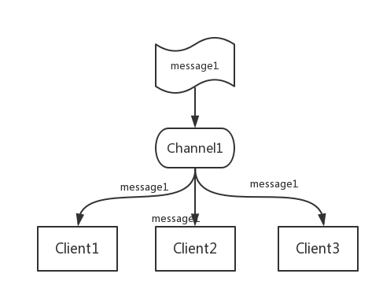

# Redis特性

### Redis发布订阅

Redis 发布订阅(pub/sub)是一种消息通信模式：发送者(pub)发送消息，订阅者(sub)接收消息。

Redis 客户端可以订阅任意数量的频道。比如这里有一个频道Channel1，有三个客户端订阅了这个频道，Client1、Client2、Client3。当通过publish命令发送消息给频道Channel1时，这个时候订阅了这个频道的3个客户端就会收到此消息。



### Redis事务

Redis 事务可以一次执行多个命令， 并且带有以下三个重要的保证：

- 批量操作在发送 EXEC 命令前被放入队列缓存。
- 收到 EXEC 命令后进入事务执行，事务中任意命令执行失败，其余的命令依然被执行。
- 在事务执行过程，其他客户端提交的命令请求不会插入到事务执行命令序列中。

一个事务从开始到执行会经历以下三个阶段：

- 开始事务。
- 命令入队。
- 执行事务。

单个 Redis 命令的执行是原子性的，但 Redis 没有在事务上增加任何维持原子性的机制，所以**Redis 事务的执行并不是原子性的**。

事务可以理解为一个打包的批量执行脚本，但批量指令并非原子化的操作，中间某条指令的失败不会导致前面已做指令的回滚，也不会造成后续的指令不做。

### Redis客户端连接

Redis 通过监听一个 TCP 端口或者 Unix socket 的方式来接收来自客户端的连接，当一个连接建立后，Redis 内部会进行以下一些操作：

- 首先，客户端 socket 会被设置为非阻塞模式，因为 Redis 在网络事件处理上采用的是非阻塞多路复用模型；
- 然后为这个 socket 设置 TCP_NODELAY 属性，禁用 Nagle 算法；
- 然后创建一个可读的文件事件用于监听这个客户端 socket 的数据发送；

得到最大连接数：

```shell
127.0.0.1:6379> config get maxclients
1) "maxclients"
2) "10000"
```

### Redis管道技术

Redis是一种基于客户端-服务端模型以及请求/响应协议的TCP服务。这意味着通常情况下一个请求会遵循以下步骤：

- 客户端向服务端发送一个查询请求，并监听Socket返回，通常是以阻塞模式，等待服务端响应。
- 服务端处理命令，并将结果返回给客户端。

Redis 管道技术可以在服务端未响应时，客户端可以继续向服务端发送请求，并最终一次性读取所有服务端的响应。管道技术最显著的优势是提高了 redis 服务的性能。

### Redis分区

分区是分割数据到多个Redis实例的处理过程，因此每个实例只保存key的一个子集。

**分区的优势**

- 通过利用多台计算机内存的和值，允许我们构造更大的数据库。
- 通过多核和多台计算机，允许我们扩展计算能力；通过多台计算机和网络适配器，允许我们扩展网络带宽。

**分区的不足**

redis的一些特性在分区方面表现的不是很好：

- 涉及多个key的操作通常是不被支持的。举例来说，当两个set映射到不同的redis实例上时，你就不能对这两个set执行交集操作。
- 涉及多个key的redis事务不能使用。
- 当使用分区时，数据处理较为复杂，比如你需要处理多个rdb/aof文件，并且从多个实例和主机备份持久化文件。
- 增加或删除容量也比较复杂。redis集群大多数支持在运行时增加、删除节点的透明数据平衡的能力，但是类似于客户端分区、代理等其他系统则不支持这项特性。然而，一种叫做presharding的技术对此是有帮助的。

**分区类型**：

Redis 有两种类型分区。 假设有4个Redis实例 R0，R1，R2，R3，和类似user:1，user:2这样的表示用户的多个key，对既定的key有多种不同方式来选择这个key存放在哪个实例中。也就是说，有不同的系统来映射某个key到某个Redis服务。

**范围分区**

最简单的分区方式是按范围分区，就是映射一定范围的对象到特定的Redis实例。

比如，ID从0到10000的用户会保存到实例R0，ID从10001到 20000的用户会保存到R1，以此类推。

这种方式是可行的，并且在实际中使用，不足就是要有一个区间范围到实例的映射表。这个表要被管理，同时还需要各 种对象的映射表，通常对Redis来说并非是好的方法。

**哈希分区**

另外一种分区方法是hash分区。这对任何key都适用，也无需是object_name:这种形式，像下面描述的一样简单：

- 用一个hash函数将key转换为一个数字，比如使用crc32 hash函数。对key foobar执行crc32(foobar)会输出类似93024922的整数。
- 对这个整数取模，将其转化为0-3之间的数字，就可以将这个整数映射到4个Redis实例中的一个了。93024922 % 4 = 2，就是说key foobar应该被存到R2实例中。注意：取模操作是取除的余数，通常在多种编程语言中用%操作符实现。


> 参考：
>
> http://www.runoob.com/redis/redis-tutorial.html