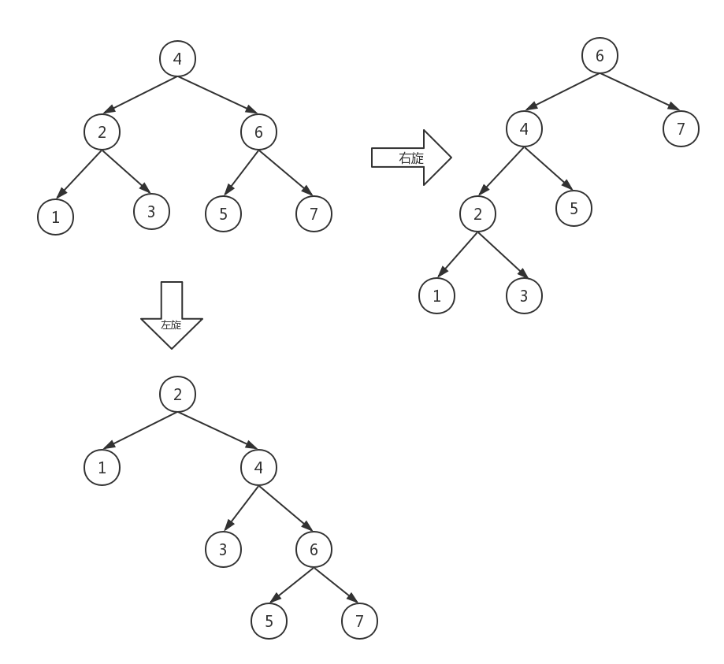

# 数据结构之二叉树

本文讲解二叉树的基本操作：

- 查找节点
- 计算树的高度
- 清空树
- 递归遍历：先序遍历、中序遍历、后序遍历
- 按层遍历
- 前序、中序的非递归遍历
- 树的左旋和右旋


**来看一下树的结构：**

```java
class TreeNode {
	String value;
	TreeNode left;
	TreeNode right;
	public TreeNode() {
		
	}
	public TreeNode(String value) {
		this.value = value;
	}
}
```

首先，为了方便后面看到效果，先手动初始化一个有4个节点的二叉树：

```java
Tree tree = new Tree();
TreeNode root = new TreeNode("root");
TreeNode node1 = new TreeNode("ndoe1");
TreeNode node2 = new TreeNode("ndoe2");
TreeNode node3 = new TreeNode("ndoe3");
root.left = node1;
root.right = node2;
node1.left = node3;
```

**查找节点**

```java
//查找节点
public TreeNode findNode(TreeNode treeNode, String value) {
  if(null == treeNode)
    return null;

  if(treeNode.value.equals(value))
    return treeNode;

  TreeNode leftNode = findNode(treeNode.left, value);//递归左子树
  TreeNode rightNode = findNode(treeNode.right, value);//递归右子树
  if(leftNode.value.equals(value))
    return leftNode;
  if(rightNode.value.equals(value))
    return rightNode;

  return null;
}
```

**计算树的深度**

```java
//计算树的深度
//递归方法
public int deepth(TreeNode treeNode) {
  if(treeNode == null)
    return 0;
  int left = deepth(treeNode.left);
  int right = deepth(treeNode.right);
  return left > right? left + 1: right + 1;
}
```

**清空树**

```java
//清空二叉树
public void clearTreeNode(TreeNode treeNode) {
  if(null != treeNode) {
    clearTreeNode(treeNode.left);
    clearTreeNode(treeNode.right);
    treeNode = null;
  }
}
```

**递归遍历**

```java
//遍历1 先序遍历
public void showDLR(TreeNode treeNode) {
  if(null != treeNode) {
    showData(treeNode);
    showDLR(treeNode.left);
    showDLR(treeNode.right);
  }
}
//遍历2 中序遍历
public void showLDR(TreeNode treeNode) {
  if(null != treeNode) {
    showLDR(treeNode.left);
    showData(treeNode);
    showLDR(treeNode.right);
  }
}
//遍历3 后序遍历
public void showLRD(TreeNode treeNode) {
  if(null != treeNode) {
    showLRD(treeNode.left);
    showLRD(treeNode.right);
    showData(treeNode);
  }
}
```

**按层遍历**

```java
//遍历4 按层遍历 借助队列 先进先出
public void showByLevel(TreeNode treeNode) {
  if(null == treeNode)
    return;

  LinkedList<TreeNode> list = new LinkedList<>();
  TreeNode current;
  list.offer(treeNode);//将根节点入队

  while(!list.isEmpty()) {
    current = list.poll();//队首出队
    showData(current);//打印节点
    if(null != current.left) {
      list.offer(current.left);
    }
    if(null != current.right) {
      list.offer(current.right);
    }
  }
}
```

运行结果：

```java
树的深度是：3
先序遍历：
root-->ndoe1-->ndoe3-->ndoe2-->
中序遍历：
ndoe3-->ndoe1-->root-->ndoe2-->
后序遍历：
ndoe3-->ndoe1-->ndoe2-->root-->
按层遍历
root-->ndoe1-->ndoe2-->ndoe3-->
```

**先序，中序遍历的非递归实现**

```java
//遍历5 前序遍历的非递归实现
public void showDLRNotRecursion(TreeNode treeNode) {
  Stack<TreeNode> stack = new Stack<>();
  TreeNode node = treeNode;
  while(null != node || stack.size() >0) {
    while(null != node) {
      showData(node);
      stack.push(node);
      node = node.left;
    }
    if(stack.size() > 0) {
      node = stack.pop();
      node = node.right;
    }
  }
}
//遍历6  中序遍历的非递归实现
public void showLDRNotRecursion(TreeNode treeNode) {
  Stack<TreeNode> stack = new Stack<>();
  TreeNode node = treeNode;
  while(null != node || stack.size() > 0) {
    while(null != node) {
      stack.push(node);
      node = node.left;
    }
    if(stack.size() > 0) {
      node = stack.pop();
      showData(node);
      node = node.right;
    }
  }
}
```

**二叉树的左旋和右旋**

- **左旋：**节点右儿子的左儿子（若存在）变为节点的右儿子，节点变为右儿子的左儿子；
- 右旋：节点左二子的右儿子（若存在）变为节点的左二子，节点变为左二子的右儿子。

举个例子：



可以看到，如果旋转前是一个二叉排序树，那么旋转后仍然是一个二叉排序树。

