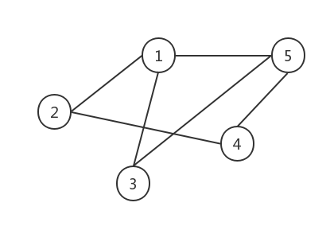

# 数据结构之图

### 1. 简介

图结构也是一种非线性数据结构。生活中有很多图结构的例子，比如通信网络、交通网络、人际关系网络等都可以归结为图结构。图结构的每个节点可以互相关联，比树结构更加复杂

下图就是一个简单的图结构：



### 2. 相关概念

- **1.有向图**

- **2. 无向图**

- **3. 顶点的度：**连接顶点的边的数量称为该顶点的度。在有向图中又分为入度和出度。

- **4. 邻接顶点：**指一条边的两个顶点。在有向图中分为入边邻接顶点和出边邻接顶点。

- **5. 无向完全图：**每两个顶点之间就有一条边。

- **6. 有向完全图：**每两个顶点之间存在方向相反的两条边。对于一个N个节点的有向完全图，边数为N(N-1)，是无向完全图的两倍。

- **7. 子图：**类似子集合，子图的顶点和边都是原图的。

- **8. 路径：**两个顶点之间的连线，可以有多条，每条长度可能不一样。路径又可以分为三种形式：
  - 简单路径：一条路径上的顶点不重复出现；
  - 环：路径的第一个顶点和最后一个顶点相同叫做环，有时也成回路；
  - 简单回路：路径的第一个顶点和最后一个顶点相同，其余顶点不重复的叫做简单回路。

- **9. 连通、连通图和连通分量：**

  - 如果两个顶点之间有路径，那么这两个顶点是连通的；
  - 无向图中任意两个顶点都是连通的，称为连通图；
  - 无向图中极大连通子图称为连通分量。

  连通图的连通分量有且仅有一个，就是它本身。

- **10. 强连通图和强连通分量：**

  - 如果两个顶点之间有路径，那么这两个顶点是连通的，注意，因为有向，有时可能是Vi -> Vj是连通的，Vj -> Vi不是连通的；
  - 如果有向图中任意两个顶点都是连通的，那么就是强连通图；
  - 有向图的最大强连通子图称为该图的强连通分量。

  强连通图的强连通分量有且仅有一个，就是它本身。

- **11. 权：**在边上表示的数值，这个数值就是该边的权。无向图中加入权值称为无向带权图，有向图中加入权值称为有向带权图。权在生活中可以表示交通图中道路的长度，人际关系中代表亲密度等。

- **12. 网（network）：**即边上带有权值的图的另一个名称，网与实际应用更为贴切。


### 3. 图的存储

在实际应用中，通常使用数组来单独保存顶点信息，然后采用二维数组保存顶点之间的关系。这种保存顶点之间关系的数组称为邻接矩阵。

```java
char[] Vertex = new char[MaxNum];  //保存顶点信息
int[][] EdgeWeight = new int[MaxNum][MaxNum];  //保存边
```

这张无向图的边就可以这样表示

```java
Vertex[0] = 1;
Vertex[1] = 2;
Vertex[2] = 3;
Vertex[3] = 4;
Vertex[5] = 5;
```


边通过EdgeWeight二维数组表示，有边的话存1，没有的话存0。比如1和2之间的表可以表示为：

```java
//数组下角标从0开始的
EdgeWeight[0][1] = 1;
EdgeWeight[1][0] = 1;
```

这个图的邻接矩阵：

| 0    | 1    | 1    | 0    | 1    |
| ---- | ---- | ---- | ---- | ---- |
| 1    | 0    | 0    | 1    | 0    |
| 1    | 0    | 0    | 0    | 1    |
| 0    | 1    | 0    | 0    | 1    |
| 1    | 0    | 1    | 1    | 0    |

因为是无向图，所以左下和右上是对称的，有向图就不是了。

### 4. 代码实例

接下来用一个代码实例来看下树的结构初始化，清空以及输出遍历操作：

```java
package com.wangjun.datastructure;

public class GraphTest {
	private final int MaxNum = 5; // 最大顶点数
	
	public static void main(String[] args) {
		GraphTest gt = new GraphTest();
		GraphMatrix gm = gt.new GraphMatrix();
		gt.createGraph(gm);
		gt.outGraph(gm);
		gt.deepTraGraph(gm);
	}
	

	// 定义邻接矩阵结构
	class GraphMatrix {
		char[] Vertex = new char[MaxNum]; // 保存顶点信息，数字或者字母
		int GType; // 类型，0：无向图，1：有向图
		int vertexNum; // 顶点的数量
		int EdgeNum; // 边的数量
		int[][] EdgeWeight = new int[MaxNum][MaxNum]; // 保存边的权
		int[] isTrav = new int[MaxNum]; // 遍历标志
	}

	// 创建邻接矩阵图
	// 这里创建手动创建一个5节点的图，对应上面的图
	public void createGraph(GraphMatrix gm) {
		gm.Vertex[0] = '1';
		gm.Vertex[1] = '2';
		gm.Vertex[2] = '3';
		gm.Vertex[3] = '4';
		gm.Vertex[4] = '5';

		gm.GType = 0;
		gm.vertexNum = 5;
		gm.EdgeNum = 6;
		gm.EdgeWeight[0][1] = 1;
		gm.EdgeWeight[1][0] = 1;
		gm.EdgeWeight[0][2] = 1;
		gm.EdgeWeight[2][0] = 1;
		gm.EdgeWeight[0][4] = 1;
		gm.EdgeWeight[4][0] = 1;
		gm.EdgeWeight[2][4] = 1;
		gm.EdgeWeight[4][2] = 1;
		gm.EdgeWeight[1][3] = 1;
		gm.EdgeWeight[3][1] = 1;
		gm.EdgeWeight[3][4] = 1;
		gm.EdgeWeight[4][3] = 1;
	}

	// 清空图
	public void clearGraph(GraphMatrix gm) {
		for (int i = 0; i < MaxNum; i++) {
			for (int j = 0; i < MaxNum; j++) {
				gm.EdgeWeight[i][j] = 0;
			}
		}
	}

	// 显示图，即显示邻接矩阵
	public void outGraph(GraphMatrix gm) {
		// 输出顶点信息
		System.out.println("顶点：");
		for (int i = 0; i < MaxNum; i++) {
			System.out.print(gm.Vertex[i] + "  ");
		}
		System.out.println();
		// 输出边的信息
		System.out.println("边：");
		for (int i = 0; i < MaxNum; i++) {
			for (int j = 0; j < MaxNum; j++) {
				System.out.print(gm.EdgeWeight[i][j] + "  ");
			}
			System.out.println();
		}
	}

	/*
	 * 遍历图，即逐个访问图的顶点，使用isTrav数组标志该节点是否被遍历过 
	 * 常用的遍历图方法：广度优先遍历法和深度优先遍历法 此函数以深度优先遍历法为例
	 * 深度遍历法类似于树的先序遍历，具体执行过程如下： 
	 * 1）从isTrav数组中选择一个未被访问的顶点Vi，将其标记为1，表示已访问过
	 * 2）从Vi的一个未被访问过的邻接点出发进行深度优先遍历 
	 * 3）重复步骤2），直至图中所有和Vi有路径相通的顶点都被访问过
	 * 4）重复步骤1）至3）的操作，直至图中所有的顶点都被访问过 
	 * 深度优先遍历法是一个递归过程
	 */
	public void deepTraGraph(GraphMatrix gm) {
		// 清除顶点访问标志
		for (int i = 0; i < gm.vertexNum; i++) {
			gm.isTrav[i] = 0;
		}
		System.out.println("深度优先遍历节点：");
		for (int i = 0; i < gm.vertexNum; i++) {
			// 若该节点未遍历
			if (gm.isTrav[i] == 0) {
				deepTraOne(gm, i);// 调用函数遍历
			}
		}
	}

	//深度遍历的执行函数
	public void deepTraOne(GraphMatrix gm, int n) {
		// 从第n个节点开始，深度遍历图
		gm.isTrav[n] = 1;
		// 输出节点数据
		System.out.println("node:" + gm.Vertex[n] + "  ");

		// 添加处理节点的操作
		for (int i = 0; i < gm.vertexNum; i++) {
			if (gm.EdgeWeight[n][i] != 0 && gm.isTrav[i] == 0) {
				deepTraOne(gm, i);// 递归进行遍历
			}
		}
	}

}
```

