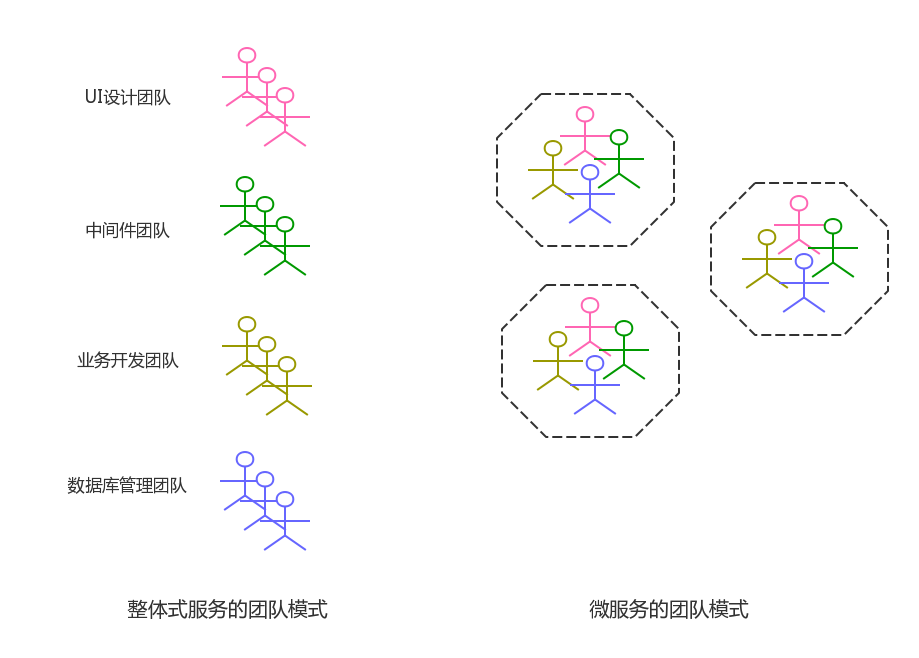

# 微服务架构入门

## 1. 微服务简介

微服务是一种架构风格，一个大型的复杂软件由一个或多个微服务组成。系统中每个微服务都可以被独立部署，各个微服务之间是松耦合的。每个微服务仅关注于完成一件任务并很好地完成任务。在所有情况下，每个任务代表这一个小的业务能力。

微服务的核心思想是：一个完整的应用由多个小的、相互独立的微服务组成，这些微服务运行在自己的进程中，开发和发布都没有依赖。不同微服务通过一些轻量级交互机制来通信，例如RPC、HTTP等，服务可独立拓展伸缩，每个服务定义了明确的边界，不同的服务甚至可以采用不同的编程语言来实现，由独立团队维护。简单的来说，一个系统的不同模块转变成不同的服务！而且服务可以使用不同的技术加以实现！

微服务的目的是为了根据**业务**有效拆分应用，实现敏捷开发和部署。

## 2. 微服务应用与整体式应用以及SOA的区别

####  2.1 与整体式（单体）应用的区别

微服务与整体式应用的主要差异在于组装应用组件，微服务架构将相关联的业务逻辑及数据放在一起形成独立的边界，其目的是在不影响其他应用组件（微服务）的情况下更快地交付并推出市场。

|        | 整体式应用                                    | 微服务应用                                    |
| ------ | ---------------------------------------- | ---------------------------------------- |
| 进程数    | 将所有功能放到同一个进程中                            | 将功能的每个元素放置到分离的多个服务进程中                    |
| 拓展方式   | 通过复制整个应用到多台服务器实现拓展                       | 通过将不同的服务分布于不同的服务器，并按需复制服务的方式实现拓展         |
| 快速响应变更 | 随着云化以及应用功能变得越来越频繁，整体式应用在快速响应市场上显得越来越力不从心。部分更新，都需要重新部署整个应用 | 部署和升级都是独立的，有助于大大提高系统变更的敏捷性。              |
| 团队结构   | 团队结构呈现垂直化，每个团队专门负责专门的一块，比如分为：UI设计团队、中间件团队、业务开发团队、数据库管理团队等。 | 团队结构呈现扁平化，每个团队服务一整个业务能力，团队中包含UI人员、中间件人员、业务开发人员和数据库管理人员，或者是全栈人员。 |
| 可用性    | 一个服务的不稳定可能导致整个应用出现问题                     | 一个服务不稳定，影响范围比较小                          |
| 创新性    | 很难引入新的技术和框架，所有功能都使用的同一种框架                | 每个微服务可以使用不同的语言和框架，引入新技术方便                |

####   2.2 与SOA的区别

看了很多网上对微服务和SOA区别的看法，分为两种，一种是对区别侃侃而谈，列举了很多，另一种认为微服务其实是SOA的一种架构实现。从中可以看出微服务和SOA还是有很多相似之处的，只是针对业务需求进行区别设计。

如果非要说区别的话，微服务架构与SOA最主要的区别在于：微服务不再强调传统SOA架构里面比较重的ESB企业服务总线，同时SOA的思想进入到单个业务系统内部实现真正的组件化。

## 3. 微服务架构的一些特性

#### 1. 通过服务实现应用的组件化

微服务架构中将组件定义为可被独立代替和升级的软件单元，在应用架构设计中通过正整体应用切分成可独立部署升级的微服务方式进行组件化设计。

#### 2.围绕业务能力组织服务

以业务能力为出发点组织服务，微服务团队的组织结构必须是跨功能的（比如：即管应用也管数据库），通常团队功能不会太大。

#### 3. 产品而非项目模式

传统的应用模式是一个团队以项目模式开发完整的应用，开发完成后就交付给运维团队负责维护，微服务架构则倡导一个团队应该负责一个“微服务”完整的生命周期，“谁开发，谁负责”。

#### 4. 智能端点和管道扁平化

微服务架构主张将组件通讯的相关业务逻辑/智能放在组件端点侧而非放在通讯组件中，通讯机制或组件应该尽量简单及松耦合。

#### 5. “去中心化”治理

整体式应用往往倾向于采取单一技术平台，微服务架构则鼓励使用合适的工具完成各自的任务，每个微服务可以考虑选用最佳工具完成，如不同的编程语言。

#### 6. “去中心化”数据管理

微服务架构倡导采用多样性持久化的方法，让每个微服务管理其自由数据库，并允许不同微服务采用不同的数据持久化技术。

#### 7. 基础设施自动化

云化及自动化部署等技术极大地降低了微服务构建、部署和运维的难度，通过应用持续集成和持续交付等方法有助于达到加速推出市场的目的。

#### 8. 故障处理设计

微服务架构所带来的一个后果就是必须考虑每个服务的失败容错机制。因此，微服务非常重视建立架构及相关业务指标的实时监控和日志机制。

#### 9. 演进式的设计

微服务应用更注重快速更新，因此系统会随时间不断演进。微服务的设计受业务功能的生命周期等因素影响。如某应用是整体式应用，但逐渐朝微服务应用架构演进，整体式应用仍是核心，但新功能将使用所提供的API构建。再如在某微服务应用中，可代替模块设计的基本原则，在实施后发现某两个微服务经常必须同时更新，则这可能意味着应将其合并为一个服务。

## 4. 微服务的优缺点

#### 优点：

- 每个服务都比较简单，可以提供更高的灵活性；
- 微服务架构的方式是松耦合的，可以提供更高的灵活性；
- 微服务可通过最佳及合适的不同开发语言与工具（比如不同的数据库）进行开发，能够做到有的放矢地解决针对性问题；
- 每个微服务可由不同团队独立开发，互不影响，加快推出市场的速度；
- 微服务架构是持续交付的巨大动力，允许在频繁发布不同服务的同时保持系统其它部分的可用性和稳定性。

#### 缺点：

微服务的想法在实践上是好的，单当整体实现时也会呈现出复杂性。

- 运维开销及成本增加：整体应用可能只需要部署至一小片应用服务区集群，而微服务可能变成需要构建/测试/部署/运行数十个独立的服务，并可能需要支持多种语言和环境。这导致一个整体式系统如果由20个微服务组成，可能需要40-60个进程。
- 必须具有DevOps开发运维一体化技能：开发人员需要熟知运维与投产环境，开发人员也需要掌握必要的数据存储技术如NoSQL，具有较强DevOps技能的人员比较稀缺。
- 隐式接口与接口匹配问题：把系统分为多个协作组件后会产生新的接口，这意味着简单的交叉变化可能需要改变许多组件，并需要协调一起发布。在实际环境中，一个新品发布可能被迫同时发布大量服务，由于集成点的大量增加，微服务架构会有更高的发布风险。
- 代码重复：某些底层功能需要被多个服务所用，为了避免将”同步耦合引入到系统中“，有时候需要向不同服务添加同样的代码，这就会导致代码重复。
- 分布式系统的复杂性：作为一种分布式系统，微服务引入了复杂性和其他若干问题，例如网络延迟、容错性、消息序列化、不可靠的网络、异步机制、版本化、差异化的工作负载等，开发人员需要考虑以上的分布式系统问题。
- 异步机制：微服务往往使用异步编程、消息并行机制，如果应用存在跨微服务的事务性处理，其实现机制会变得复杂化。
- 可测性的挑战：在动态环境下服务间的交互会产生非常微妙的行为，难以可视化及全面测试。经典微服务往往不太重视测试，更多的是通过监控发现生产环境的异常，进而快速回滚或采取必要的其他行动，但对于特别在意风险规避监管或投产环境错误会产生显著影响的场景下需要特别注意。
- 部署复杂：一个单体应用只需要在复杂均衡器后面部署各自的服务器就好了。每个应用实例是需要配置诸如数据库和消息中间件等基础服务。相比之下，一个微服务应用一般由大批服务构成，这就形成大量需要配置、部署、扩展和监控的部分。除此之外，你还需要完成一个服务发现机制，以用来发现与它通讯服务的地址（包括服务器地址和端口）。

## 5. 微服务的取舍

1. 在合适的项目，合适的团队，采用微服务架构收益会大于成本。
2. 微服务架构有很多吸引人的地方，但在拥抱微服务之前，也需要认清它所带来的挑战。
3. 需要避免为了“微服务”而“微服务”。
4. 微服务架构引入策略 – 对传统企业而言，开始时可以考虑引入部分合适的微服务架构原则对已有系统进行改造或新建微服务应用，逐步探索及积累微服务架构经验，而非全盘实施微服务架构。

> 参考：
>
> 什么是微服务：https://blog.csdn.net/fly_zhyu/article/details/76408158
>
> 什么是微服务架构：https://www.roncoo.com/article/detail/130121
>
> 你不愿意做微服务架构的十个理由：https://blog.csdn.net/gsying1474/article/details/70226961
>
> SOA和微服务架构的区别：https://www.zhihu.com/question/37808426
>
> 微服务和SOA的区别：https://www.zhihu.com/question/37808426
