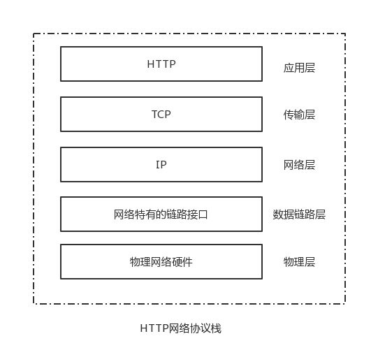
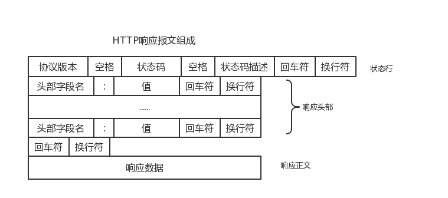

# HTTP协议入门

HTTP协议是Hypertext Transfer Protocol超文本传输协议的缩写。HTTP协议属于应用层协议，它构建在TCP和IP协议之上，处于TCP/IP体系架构中的顶端，使用TCP/IP协议来传输数据。这样一来它就不必处理下层协议间诸如丢包补发、握手及数据的分段和重新组装等。



### 主要特点：

- 简单快速：客户向服务器请求服务时，只需传送请求方法和路径。请求方法常用的有GET、POST。每种方法规定了客户与服务器联系的类型不同。由于HTTP协议简单，使得HTTP服务器的程序规模小，因而通信速度很快。
- 灵活：HTTP允许传输任意类型的数据对象。正在传输的类型由Content-Type加以标记。
- 无连接：无连接的含义是限制每次连接只处理一个请求。服务器处理完客户的请求，并收到客户的应答后，即断开连接。采用这种方式可以节省传输时间。
- 无状态：HTTP协议是无状态协议。无状态是指协议对于事务处理没有记忆能力。缺少状态意味着如果后续处理需要前面的信息，则它必须重传，这样可能导致每次连接传送的数据量增大。另一方面，在服务器不需要先前信息时它的应答就较快。为了解决这个问题，引入cookie和session。

### HTTP请求与响应过程

1. 浏览器根据所使用的HTTP协议，解析出url对应的域名；
2. 通过DNS域名解析，查询出该域名对应的IP地址；
3. 通过URL解析出对应的端口号，如果是80，默认可以省略；
4. 浏览器根据ip和端口建立TCP连接；
5. 浏览器向服务器发送一条HTTP请求报文，比如get请求；
6. 服务器相应请求，并发送给浏览器返回报文；
7. 浏览器渲染网页并关闭与服务器的连接。

**小技巧**

- 在Chrome中查询DNS缓存：

  ```
  chrome://net-internals/#dns
  ```


### HTTP请求的报文格式

一个HTTP请求报文由请求行（request line）、请求头部（request header）、空行和请求数据组成，如下图：


**请求行：**请求行分为三个部分：请求方法、请求地址和协议版本。

- 请求方法：HTTP/1.1 定义的**请求方法**有8种：GET、POST、PUT、DELETE、PATCH、HEAD、OPTIONS、TRACE。最常的两种GET和POST，如果是RESTful接口的话一般会用到GET、POST、DELETE、PUT。

- 请求地址：URL:统一资源定位符，是一种资源的唯一定位标志。

  组成：<协议>：//<主机>：<端口>/<路径>

- 协议版本：格式为：HTTP/主版本号.次版本号，常用的有HTTP/1.0和HTTP/1.1。

**请求头部：**

请求头部为请求报文添加了一些附加信息，由“名/值”对组成，每行一对，名和值之间使用冒号分隔。

请求头部的最后会有一个空行，表示请求头部结束，接下来为请求数据，这一行非常重要，必不可少。

请求头部内容的详细介绍可以参考：[我的gitbook:HTTP的请求格式](https://wangjun-scu.gitbooks.io/learnjava/content/%E6%8A%80%E6%9C%AF%E5%AD%A6%E4%B9%A0/%E8%AE%A1%E7%AE%97%E6%9C%BA%E7%BD%91%E7%BB%9C/HTTP_POST%E8%AF%B7%E6%B1%82%E7%9A%84%E6%95%B0%E6%8D%AE%E6%A0%BC%E5%BC%8F.html)

**请求数据：**

可选部分，比如GET请求就没有请求数据。

下面是一个POST方法的请求报文：

> POST 　/index.php　HTTP/1.1 　　 请求行
> Host: localhost
> User-Agent: Mozilla/5.0 (Windows NT 5.1; rv:10.0.2) Gecko/20100101 Firefox/10.0.2　　请求头
> Accept: text/html,application/xhtml+xml,application/xml;q=0.9,*/*;q=0.8
> Accept-Language: zh-cn,zh;q=0.5
> Accept-Encoding: gzip, deflate
> Connection: keep-alive
> Referer: <http://localhost/>
> Content-Length：25
> Content-Type：application/x-www-form-urlencoded
> 　　空行
> username=aa&password=1234　　请求数据

### HTTP响应的报文格式

HTTP响应报文主要由状态行、响应头部、空行以及响应数据组成。



**状态行：**

3部分组成，分别为：协议版本，状态码，状态码描述。

- 状态码：

  状态代码为3位数字。
  1xx：指示信息--表示请求已接收，继续处理。
  2xx：成功--表示请求已被成功接收、理解、接受。
  3xx：重定向--要完成请求必须进行更进一步的操作。
  4xx：客户端错误--请求有语法错误或请求无法实现。
  5xx：服务器端错误--服务器未能实现合法的请求。

比如200表示响应成功，404表示请求的网页不存在，500表示服务器内部错误等。

**响应头部：**

和请求头部类似，可以参考：[我的gitbook:HTTP的请求格式](https://wangjun-scu.gitbooks.io/learnjava/content/%E6%8A%80%E6%9C%AF%E5%AD%A6%E4%B9%A0/%E8%AE%A1%E7%AE%97%E6%9C%BA%E7%BD%91%E7%BB%9C/HTTP_POST%E8%AF%B7%E6%B1%82%E7%9A%84%E6%95%B0%E6%8D%AE%E6%A0%BC%E5%BC%8F.html)

**响应正文：**

用于存放需要返回给客户端的数据信息。

下面是一个响应报文的实例：

> HTTP/1.1 200 OK　　状态行
> Date: Sun, 17 Mar 2013 08:12:54 GMT　　响应头部
> Server: Apache/2.2.8 (Win32) PHP/5.2.5
> X-Powered-By: PHP/5.2.5
> Set-Cookie: PHPSESSID=c0huq7pdkmm5gg6osoe3mgjmm3; path=/
> Expires: Thu, 19 Nov 1981 08:52:00 GMT
> Cache-Control: no-store, no-cache, must-revalidate, post-check=0, pre-check=0
> Pragma: no-cache
> Content-Length: 4393
> Keep-Alive: timeout=5, max=100
> Connection: Keep-Alive
> Content-Type: text/html; charset=utf-8
> 　　空行
>
> <html>　　响应数据
> <head>
> <title>HTTP响应示例<title>
> </head>
> <body>
> Hello HTTP!
> </body>
> </html>

### GET和POST的区别和联系

1. GET提交的数据会放在URL之后，以?分割URL和传输数据，参数之间以&相连，如EditPosts.aspx?name=test1&id=123456. POST方法是把提交的数据放在HTTP包的Body中；
2. GET提交的数据大小有限制（因为浏览器对URL的长度有限制），而POST方法提交的数据没有限制，不过一般WEB服务器会对post的请求大小进行限制；
3. GET方式提交数据，会带来安全问题，比如一个登录页面，通过GET方式提交数据时，用户名和密码将出现在URL上，如果页面可以被缓存或者其他人可以访问这台机器，就可以从历史记录获得该用户的账号和密码。

> 参考：
>
> https://blog.csdn.net/yezitoo/article/details/78193794
>
> https://www.cnblogs.com/ranyonsue/p/5984001.html