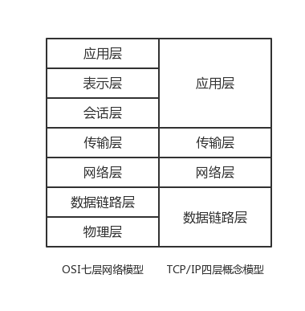

# TCP/IP协议入门

## 1. 简介

Transmission Control Protocol/Internet Protocol的简写，即传输控制协议/因特网互联协议。它是网络通信的一套协议集合。

先来看一下OSI和TCP/IP模型：

#### 应用层

就是应用软件使用的协议，如邮箱使用的POP3，SMTP、远程登录使用的Telnet、获取IP地址的DHCP、域名解析的DNS、网页浏览的http协议等；这部分协议主要是规定应用软件如何去进行通信的。

#### 表现层

决定数据的展现（编码）形式，如同一部电影可以采样、量化、编码为RMVB、AVI，一张图片能够是JPEG、BMP、PNG等。

#### 会话层

为两端通信实体建立连接（会话），中间有认证鉴权以及检查点记录（供会话意外中断的时候可以继续，类似断点续传）。

#### 传输层

将一个数据/文件斩件分成很多小段，标记顺序以被对端接收后可以按顺序重组数据，另外标记该应用程序使用的端口号及提供QOS。TCP（传输控制协议）和UDP（用户数据报协议）就是属于传输层协议。

#### 网络层

路由选路，选择本次通信使用的协议（http、ftp等），指定路由策略及访问控制策略。（IP地址在这一层）

#### 数据链路层

根据端口与MAC地址，做分组（VLAN）隔离、端口安全、访问控制。（MAC地址在这一层）处理VLAN内的数据帧转发，跨VLAN间的访问，需要上升到网络层。

#### 物理层

将数据最终编码为用0、1标识的比特流，然后传输。（例如将题主头像的图片，变为一串01100111100这样的数字来表示）。

## 2. TCP的三次握手和四次挥手

先来看一张经典的图，这个图清晰简明的体现了TCP三次握手和四次挥手的流程。

#### 来解释其中的名词：

**SYN：**即Synchronization，表示同步序号，用来建立连接，当SYN=1而ACK=0时，表明这是一个连接请求报文。对方若同意建立连接，则应在响应报文中使SYN=1和ACK=1. 因此, SYN置1就表示这是一个连接请求或连接接收报文。

**Seq：**即Sequence Number，用来标识从TCP发送端向TCP接收端发送的数据字节流，它表示在这个报文段中的第一个数据字节在数据流中的序号；主要用来解决网络报乱序的问题。

**ACK：**此标志表示应答域有效，就是说前面所说的TCP应答号将会包含在TCP数据包中；有两个取值：0和1，为1的时候表示应答域有效，反之为0；TCP协议规定，只有ACK=1时有效，也规定连接建立后所有发送的报文的ACK必须为1。**（注意：和下面的Acknowledgment Number不一样，可以理解ACK是Acknowledgment Number的标志位）**

**Acknowledgment Number：**32位确认序列号包含发送确认的一端所期望收到的下一个序号，因此，确认序号应当是上次已成功收到数据字节序号加1。不过，只有当标志位中的ACK标志（下面介绍）为1时该确认序列号的字段才有效。主要用来解决不丢包的问题；

**FIN：**即finis，终结的意思， 用来释放一个连接。当 FIN = 1 时，表明此报文段的发送方的数据已经发送完毕，并要求释放连接。

### 三次握手过程

#### 第一次握手：

建立连接。客户端A发送连接请求报文段，SYN为1，seq为x，然后，客户端A进入SYN_SEND状态，等待服务器B的确认，服务端B由SYN=1知道，A要求建立联机；

#### 第二次握手：

服务端B收到请求后要确认联机信息，向A发送ack number=(A的seq+1)，SYN=1，ACK=1，随机产生seq的包，此时服务器进入SYN_RECV状态；

#### 第三次握手：

客户端A收到后检查ack number是否正确，即第一次发送的seq+1,以及位码ACK是否为1，若正确，客户端A会再发送ack number=(服务端B的seq+1)，ack=1，主机B收到后确认seq值与ack=1则连接建立成功，客户端和服务器端都进入ESTABLISHED状态，完成TCP三次握手。

完成了三次握手，客户端和服务器端就可以开始传送数据。以上就是TCP三次握手的总体介绍。

#### 三次握手的一个实例：

**第一次握手：**客户端A发送位码syn＝1,随机产生seq number=3626544836的数据包到服务端B，服务端B由SYN=1知道客户端A要求建立联机；

**第二次握手：**服务端B收到请求后要确认联机信息，向客户端A发送ack number=3626544837，yn=1，ack=1，随机产生seq=1739326486的包；

**第三次握手：**客户端A收到后检查ack number是否正确，即第一次发送的seq number+1,以及位码ack是否为1，若正确，客户端A会再发送ack number=1739326487，ack=1，服务端B收到后确认seq=seq+1,ack=1则连接建立成功。

### 四次挥手过程

#### 第一次挥手：

主机A（可以使客户端，也可以是服务器端），设置seq和ack number，向主机2发送一个FIN报文段，此时，主机A进入FIN_WAIT_1状态，这表示主机1没有数据要发送给主机2了；

#### 第二次挥手：

主机B收到了主机A发送的FIN报文段，向主机1回一个ACK报文段，ack number为A的seq加1，主机A进入FIN_WAIT_2状态，主机B告诉主机A，我“同意”你的关闭请求；

#### 第三次挥手：

主机B向主机A发送FIN报文段，请求关闭连接，同时主机2进入LAST_ACK状态；

#### 第四次挥手：

主机A收到主机B发送的FIN报文段，向主机B发送ACK报文段，然后主机A进入TIME_WAIT状态，主机B收到主机A的ACK报文段以后，就关闭连接，此时，主机A等待2MSL后依然没有收到回复，则证明主机B已正常关闭，主机A也可以关闭连接了。

至此，TCP的四次分手就这么愉快的完成了。

## 3. 为什么需要三次握手

已失效的连接请求报文段”的产生在这样一种情况下：client发出的第一个连接请求报文段并没有丢失，而是在某个网络结点长时间的滞留了，以致延误到连接释放以后的某个时间才到达server。本来这是一个早已失效的报文段。但server收到此失效的连接请求报文段后，就误认为是client再次发出的一个新的连接请求。于是就向client发出确认报文段，同意建立连接。假设不采用“三次握手”，**那么只要server发出确认，新的连接就建立了。由于现在client并没有发出建立连接的请求，因此不会理睬server的确认，也不会向server发送ack包。（此时因为client没有发起建立连接请求，所以client处于CLOSED状态，接受到任何包都会丢弃）但server却以为新的运输连接已经建立，并一直等待client发来数据。这样，server的很多资源就白白浪费掉了。**采用“三次握手”的办法可以防止上述现象发生。例如刚才那种情况，client不会向server的确认发出确认。server由于收不到确认，就知道client并没有要求建立连接。

## 4. 为什么需要四次挥手

TCP协议是一种面向连接的、可靠的、基于字节流的运输层通信协议。TCP是全双工模式，这就意味着，当主机1发出FIN报文段时，只是表示主机1已经没有数据要发送了，主机1告诉主机2，它的数据已经全部发送完毕了；**但是，这个时候主机1还是可以接受来自主机2的数据**；当主机2返回ACK报文段时，表示它已经知道主机1没有数据发送了，但是主机2还是可以发送数据到主机1的；当主机2也发送了FIN报文段时，这个时候就表示主机2也没有数据要发送了，就会告诉主机1，我也没有数据要发送了，之后彼此就会愉快的中断这次TCP连接。如果要正确的理解四次分手的原理，就需要了解四次分手过程中的状态变化。

> 参考：
>
> OSI模型讲解：https://www.zhihu.com/question/24002080/answer/31817536
>
> 理解TCP的三次握手，四次挥手：https://www.jianshu.com/p/ce6bd119a4eb?utm_campaign=hugo&utm_medium=reader_share&utm_content=note&utm_source=weixin-friends
>
> 三次握手，四次挥手：https://www.jianshu.com/p/092705233d37

